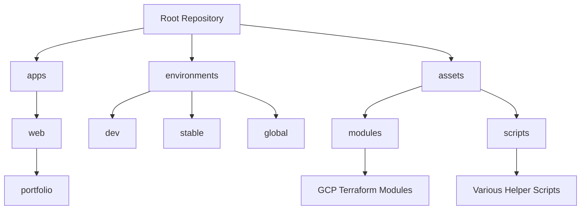

# Portfolio

[](https://cloud.google.com/) [](https://www.terraform.io/) [](https://github.com/features/actions)

A comprehensive infrastructure monorepo containing Terraform modules, deployment scripts, and web applications for Google Cloud Platform infrastructure.

## 📦 Repository Structure



### Applications
- **web/portfolio** - Portfolio web application

## 🚀 Getting Started

### Prerequisites
- Git 2.x or higher
- Terraform 1.x or higher
- Google Cloud SDK
- GitHub CLI (for github-ops-cli)

### Clone Repository with Submodules
```bash
# Clone the main repository with all submodules
git clone --recursive <repository-url>

# If already cloned, initialize and update submodules
git submodule update --init --recursive
```

### Submodule Management
```bash
# Update all submodules to their latest versions
git submodule update --remote

# Update a specific submodule
git submodule update --remote assets/modules/tf-gcp-project
```

## 🔧 Module Usage

### Terraform Modules
Each Terraform module is independently versioned and can be used in your Terraform configurations:

```hcl
module "gcp_project" {
  source = "git::https://github.com/ranson21/portfolio/assets/modules/tf-gcp-project?ref=master"
  # Module specific variables
}
```

### Scripts and Tools
1. GitHub Ops CLI
```bash
cd assets/scripts/github-ops-cli
# Follow module-specific README for setup
```

2. Cloud Functions
```bash
cd assets/scripts/cloud-functions
# Follow module-specific README for setup
```

## 📖 Documentation

Each submodule contains its own README with specific documentation. Please refer to individual module documentation for detailed usage instructions.

### Key Modules Documentation
- [Portfolio Web App](apps/web/portfolio/README.md)
- [OpenVPN Web App](apps/web/gcp-ovpn-portal/README.md)

## 🔄 Update Strategy

1. **Regular Updates**
```bash
# Update all submodules to latest versions
git submodule update --remote
git add .
git commit -m "chore: update submodules to latest versions"
```

2. **Specific Module Updates**
```bash
cd assets/modules/tf-gcp-project
git checkout master
git pull
cd ../../..
git add assets/modules/tf-gcp-project
git commit -m "chore: update GCP project module"
```

## 🤝 Contributing

1. Each submodule should be developed in its own repository
2. Changes should be committed to submodules first
3. Parent repository should be updated to point to new submodule versions
4. Follow each submodule's specific contribution guidelines

## 🔒 Security

- All modules are pinned to specific versions/commits
- Security updates are managed through GitHub Security advisories
- Regular security audits are performed on infrastructure modules

## 📄 License

This project is licensed under the MIT License - see the [LICENSE](LICENSE) file for details.

## 👥 Maintainers

- Please refer to each submodule's README for specific maintainer information
- For overall repository issues, contact [Abigail Ranson](mailto:abby@abbyranson.com)

## 🌟 Acknowledgments

- Google Cloud Platform team
- Terraform and HashiCorp
- All individual module contributors